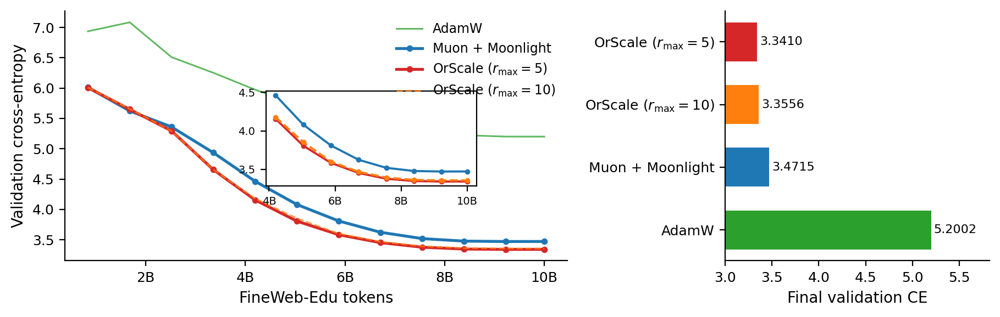

# OrScale

**Orthogonalised Optimization with Layer-Wise Trust-Ratio Scaling**

[](https://arxiv.org/abs/2605.07815)
[](LICENSE)
[](https://www.python.org/downloads/)
[](https://pytorch.org/)

OrScale equips Muon's orthogonalised matrix update with LARS/LAMB-style
layer-wise magnitude control. The recipe rests on a single design principle:
**the trust-ratio denominator must measure the Frobenius norm of the
parameter-space direction the optimizer is about to subtract from the
weights.** The principle yields a unified, parameter-light algorithm with two
specialisations — `OrScale` (general / vision) and `OrScale-LM` (language
modelling) — and rules out three superficially natural Muon–LAMB hybrids that
fail in practice through degenerate denominators, clip saturation, or
weight-norm runaway.

> **Paper:** [Lou & You, 2026 — *OrScale: Orthogonalised Optimization with Layer-Wise Trust-Ratio Scaling*](https://arxiv.org/abs/2605.07815) (arXiv:2605.07815).
>
> **Code:** [NUS-HPC-AI-Lab/OrScale](https://github.com/NUS-HPC-AI-Lab/OrScale).

---

## Highlights

- **Algorithm.** A drop-in extension of Muon: keep the orthogonalised
  direction $Q_\ell = \mathrm{NS}_k(\widetilde M_\ell)$, scale it by a clipped
  layer-wise trust ratio, and couple weight decay into the trust-ratio-scaled
  step. One fp32 scalar per layer for the LM variant; below 1% wall-clock
  overhead vs. Muon.
- **Theory.** A nuclear-norm $O(1/\sqrt{T})$ nonconvex convergence guarantee, a
  layer-adaptive descent constant $\kappa_{\mathrm{eff}} > 1$ under measurable
  layer heterogeneity, and a strict separation from raw-momentum
  Muon–trust-ratio variants under empirically verified clip saturation.
- **Empirics.** OrScale ranks first on CIFAR-10 / DavidNet across three seeds,
  and OrScale-LM beats Muon + Moonlight on FineWeb-Edu pre-training at three of
  four dense scales (125M → 1.1B parameters), beats AdamW at every scale, and
  widens the gap to **+0.130 nats** on a Moonlight-16B-A3B mixture-of-experts
  model at wall-clock parity, with every hyperparameter inherited unchanged
  from the Moonlight recipe.
- **Scale.** A Moonlight-16B-A3B MoE implementation (multi-head latent
  attention, 64 routed + 2 shared experts, aux-loss-free router balancing)
  with ZeRO-1 optimizer-state sharding designed for Muon-family optimizers,
  bf16 parameters, activation checkpointing, and TensorBoard logging for
  offline clusters.
- **Reproducibility.** Single-command training entry points, deterministic
  configs, and shipped sweep scripts; the public results in this repository
  match the paper's tables and figures.

## Method at a Glance

Both variants share Muon's front end (Nesterov-lookahead momentum followed by
$k$ Newton–Schulz iterations to obtain the polar factor $Q_\ell$) and apply a
clipped trust-ratio multiplier. With weight $W_\ell \in \mathbb{R}^{m_\ell \times n_\ell}$,
weight decay $\lambda$, shape factor $s_\ell$, and per-layer calibration
constant $c_{\mathrm{denom},\ell}$:

$$
D_{\ell,t} \;=\; \lambda W_{\ell,t} + s_\ell\, Q_{\ell,t},
\qquad
r_{\ell,t} \;=\; \frac{\lVert W_{\ell,t} \rVert_F}{c_{\mathrm{denom},\ell}\,\lVert D_{\ell,t} \rVert_F + \varepsilon},
$$

$$
W_{\ell,t+1} \;=\; W_{\ell,t} \;-\; \eta_t\,\mathrm{clip}(r_{\ell,t},\,r_{\min},\,r_{\max})\,D_{\ell,t}.
$$

The two recommended specialisations:

| Variant | Config name | Intended use | Shape factor $s_\ell$ | Calibration $c_{\mathrm{denom},\ell}$ |
|---|---|---|---|---|
| **OrScale** | `orscale` | General matrix layers, vision experiments | $1$ | $1$ |
| **OrScale-LM** | `orscale_lm` | Language-model pre-training | $0.2\sqrt{\max(m_\ell, n_\ell)}$ | Set once at the first non-zero step so $r_{\ell,0} = 1$ |

`OrScale-LM` adopts the Moonlight shape factor and a one-time per-layer
calibration that anchors every trust ratio at one, propagating learning-rate
transfer from AdamW → Muon + Moonlight → OrScale-LM without an extra sweep.

For the full algorithm, theoretical statements, and design-space analysis
(including the failure modes that this principle rules out), see the
[paper](https://arxiv.org/abs/2605.07815).

## Installation

OrScale targets PyTorch ≥ 2.0 and Python ≥ 3.10.

```bash
python -m pip install -e .
```

Optional extras are split by workflow:

```bash
python -m pip install -e ".[dev]"
python -m pip install -e ".[data,vision,eval,analysis,wandb,tensorboard]"
```

For the all-in-one compatibility path:

```bash
python -m pip install -r requirements.txt
```

## Quick Start

Language-model smoke run:

```bash
python scripts/train.py --config configs/pilot_25m.yaml \
    --set optimizer.name=orscale_lm
```

CIFAR-10 / DavidNet run:

```bash
python scripts/train_vision.py --config configs/cifar10_davidnet.yaml \
    --set optimizer.name=orscale
```

The default configs use relative paths such as `data/fineweb10B/`,
`data/cifar10/`, and `checkpoints/`. Override paths with
`--set data.train_pattern=... data.val_pattern=... training.save_dir=...`.

W&B logging is opt-in. Set `logging.wandb_project` in the config or via
command-line overrides to enable it. TensorBoard logging is opt-in as well:
set `logging.tensorboard: true` (and optionally `logging.tensorboard_log_dir`)
to write scalars under `runs/<group>/<name>/`, which is convenient on offline
clusters.

## Mixture-of-Experts Training

`orscale/model/moonlight_moe.py` implements the public Moonlight-16B-A3B
architecture (DeepSeek-V3 style): 27 layers, hidden size 2048, multi-head
latent attention, 64 routed experts with top-6 routing plus 2 shared experts,
aux-loss-free router-bias balancing (an auxiliary loss is available as an
option), and 8K context, for 15.96B total / 2.24B active parameters per token.
Select it with `model.architecture: moonlight_moe`; the `moonlight_16b_a3b`
preset and a `moonlight_tiny_moe` smoke-test preset
(`configs/moonlight_moe_tiny.yaml`) are provided.

Training-side features that ship with it (all off unless enabled in the
config):

| Config key | Effect |
|---|---|
| `optimizer.zero_stage: 1` | ZeRO-1-style optimizer-state sharding for Muon-family optimizers: parameters and gradients stay replicated so the orthogonalised update sees the full matrix, while momentum / Adam moments are partitioned across ranks and owner ranks broadcast updated parameters after each step. Checkpoints store per-rank optimizer sidecars next to the model file. |
| `model.param_dtype: bfloat16` | Keep parameters in bf16 instead of fp32 master weights. |
| `model.checkpoint_moe` / `model.checkpoint_mlp` | Activation checkpointing for the expert / MLP blocks. |
| `diagnostics.log_per_param: false` + `diagnostics.selected_param_patterns` | Log per-layer trust ratios only for glob-selected parameters, alongside cross-layer mean / p05 / p50 / p95 / std aggregates, instead of one entry per matrix layer. |

The 16B-A3B comparison in the paper is launched with the wrapper below. It
derives the 10B-token step count from
`configs/moonlight_moe_16b_fineweb10b_compare.yaml` and runs one optimizer
cell at a time; it defaults to `DRY_RUN=1` and only prints the commands:

```bash
# Print the derived commands for every optimizer cell.
bash scripts/run_moonlight_moe_16b_fineweb10b.sh

# Launch one cell on 8 GPUs (torchrun --standalone --nproc_per_node=8).
OPTIMIZER=orscale_lm DRY_RUN=0 \
    TRAIN_PATTERN="data/fineweb10B/fineweb_train_*.bin" \
    VAL_PATTERN="data/fineweb10B/fineweb_val_*.bin" \
    bash scripts/run_moonlight_moe_16b_fineweb10b.sh
```

Expert / model-state parallelism is not implemented: every data-parallel rank
materialises all routed experts, so the 16B configuration is sized for a single
8-GPU node (the paper's runs used 8 × H20).

## Empirical Results

### CIFAR-10 / DavidNet

Best learning rate per optimizer; validation top-1 averaged over the last three
of 24 epochs, then over three seeds ($\pm 1\sigma$).

| Rank | Optimizer | LR | Val top-1 (%) |
|---:|---|---:|---:|
| 1 | **OrScale** (ours) | 0.02 | **94.05 ± 0.08** |
| 2 | Muon + Moonlight | 0.01 | 93.75 ± 0.17 |
| 3 | Muon | 0.04 | 93.70 ± 0.14 |
| 4 | AdamW | 0.01 | 93.12 ± 0.04 |
| 5 | LAMB | 0.01 | 92.40 ± 0.20 |

OrScale improves Muon by **+0.35 points** and Muon + Moonlight by
**+0.30 points**, while LAMB — the standard trust-ratio baseline — trails by
**1.65 points**, confirming that a direct LAMB-style port to Muon is not
competitive without the design principle above.

### FineWeb-Edu Pre-Training

Final validation cross-entropy at four model scales spanning a 48× compute
range. Lower is better; **bold** marks the best optimizer at each scale.
Compute $C = 6ND$ in PFLOP-days (Kaplan estimate).

| Scale | Compute (PFD) | AdamW | Muon + Moonlight | **OrScale-LM** (ours) |
|---|---:|---:|---:|---:|
| 125M, 5.24B tok | 0.046 | 3.3721 | 3.2319 | **3.2120** |
| 399M, 8.92B tok | 0.247 | 2.9966 | **2.9183** | 2.9247 |
| 545M, 14.04B tok | 0.531 | 2.9235 | 2.8130 | **2.8049** |
| 1.1B, 28.54B tok | 2.18 | 2.7304 | 2.6360 | **2.6251** |

OrScale-LM beats AdamW at every scale from 125M to 1.1B and beats
Muon + Moonlight at three of four scales; the 399M cell is a tie within
single-seed noise. The fitted Kaplan-style scaling-law exponents are
$\alpha = -0.054$ (AdamW), $-0.053$ (Muon + Moonlight), and $-0.052$
(OrScale-LM); the OrScale-LM advantage is approximately preserved across the
swept compute range.

### Moonlight-16B-A3B MoE (FineWeb-Edu, 10B tokens)

Head-to-head pre-training on the Moonlight-16B-A3B mixture-of-experts
architecture, 14.5× the parameter count of the largest dense run: 8K context,
2048 sequences (16.8M tokens) per step, 596 steps ≈ 10B FineWeb-Edu tokens,
bf16, ZeRO-1, 8 × H20, seed 42. Every arm uses the Moonlight-recipe
hyperparameters for this scale (LR 4.2e-4, weight decay 0.1, momentum 0.95,
warmup 60 steps, cosine decay), shared by AdamW and Muon + Moonlight by
construction and inherited unchanged by OrScale-LM, which was never swept.



*Left:* validation cross-entropy over FineWeb-Edu tokens (inset: final 6B
tokens). *Right:* final values.

| Optimizer | $r_{\min}$ / $r_{\max}$ | Final val CE | Δ vs. Muon + Moonlight | Wall-clock |
|---|:---:|---:|---:|---:|
| AdamW | — | 5.2002 | −1.7287 | 3.93 d |
| Muon + Moonlight | — | 3.4715 | — | 4.98 d |
| OrScale-LM ($r_{\max}=10$) | 0.1 / 10 | 3.3556 | +0.1159 | 4.92 d |
| **OrScale-LM** (ours) | 0.1 / 5 | **3.3410** | **+0.1305** | 4.92 d |

OrScale-LM improves on Muon + Moonlight by **0.130 nats (3.8 % relative)** at
wall-clock parity, an order of magnitude beyond the +0.011-nat gap at 1.1B
dense. It leads at every validation checkpoint from about 2.5B tokens onward
and passes Muon + Moonlight's final loss with roughly a third of the tokens
still to go. The looser $r_{\max}=10$ arm also beats Muon + Moonlight, so the
gain is not an artefact of a tight clip. Caveats: a single seed per arm (about
five days per arm), and the AdamW arm runs at the shared recipe LR following
the Moonlight protocol rather than at a retuned AdamW optimum.

## Data Preparation

FineWeb-Edu token shards:

```bash
python scripts/prepare_data.py --version 10B
```

CIFAR-10:

```bash
python scripts/prepare_vision_data.py --dataset cifar10
```

ImageNet expects the standard `ImageFolder` layout. See
`scripts/prepare_vision_data.py` for tarball extraction support.

## Tests

```bash
pytest tests/ -v
```

The Newton–Schulz kernel is compiled with `torch.compile` only when CUDA is
available, so CPU-only machines need no extra flags. To opt out of compilation
on GPU machines (for example while debugging), set
`ORSCALE_DISABLE_TORCH_COMPILE=1`.

## Repository Layout

```text
orscale/      Core optimizers, models (GPT, Moonlight MoE), data loaders, trainers, eval, analysis
configs/      Example LM, MoE, vision, and scaling-law configs
scripts/      Training, data preparation, evaluation, and sweep entry points
tests/        Unit and smoke tests
assets/       Figures embedded in this README
```

Generated outputs under `results/`, `reports/`, checkpoints, datasets,
W&B runs, and local logs are intentionally git-ignored.

## Roadmap

- Expert / model-state parallelism for the MoE path (ZeRO-1 currently shards
  optimizer state only).
- Larger-scale empirical evaluation of OrScale on additional vision and
  language benchmarks.
- TPU adaptation of the orthogonalised front end and trust-ratio computation.
- Integration with attention stabilisers (e.g. MuonClip) and very-large-batch
  training regimes where layer-wise magnitude control is most pronounced.

## Citation

If you use OrScale in your research, please cite the paper:

```bibtex
@misc{lou2026orscaleorthogonalisedoptimizationlayerwise,
      title={OrScale: Orthogonalised Optimization with Layer-Wise Trust-Ratio Scaling},
      author={Yuxuan Lou and Yang You},
      year={2026},
      eprint={2605.07815},
      archivePrefix={arXiv},
      primaryClass={cs.LG},
      url={https://arxiv.org/abs/2605.07815},
}
```

The repository ships a `CITATION.cff` so GitHub can surface this metadata
directly on the project page.

## License

OrScale is released under the MIT License. See [`LICENSE`](LICENSE) for
details.

## Acknowledgements

OrScale builds on the orthogonalised-update line of work
([Muon](https://github.com/KellerJordan/modded-nanogpt),
[Moonlight](https://arxiv.org/abs/2502.16982)) and on classical trust-ratio
optimizers (LARS, LAMB). We thank the broader optimizer-research community for
open implementations and reproducible baselines.
