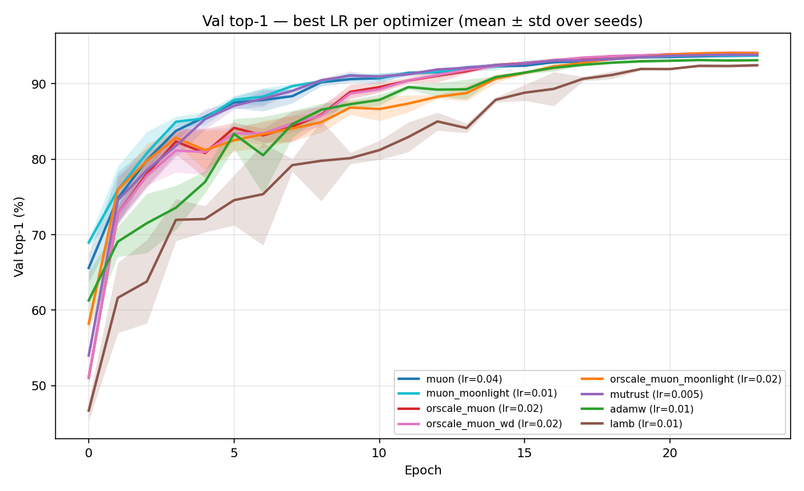
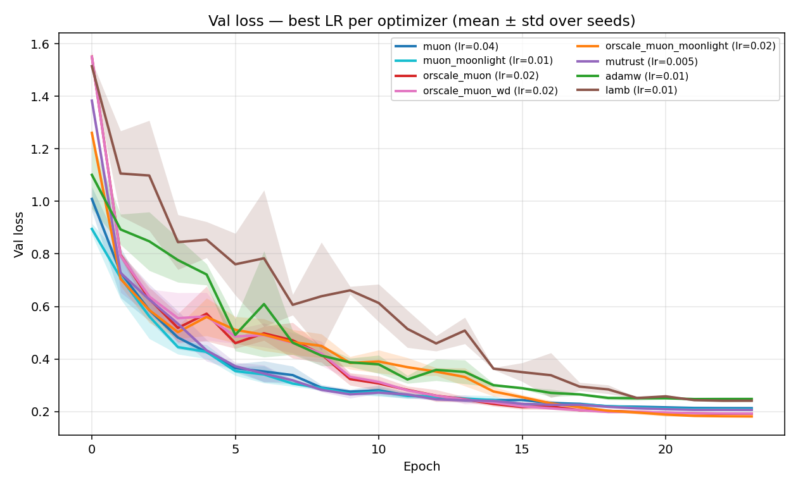
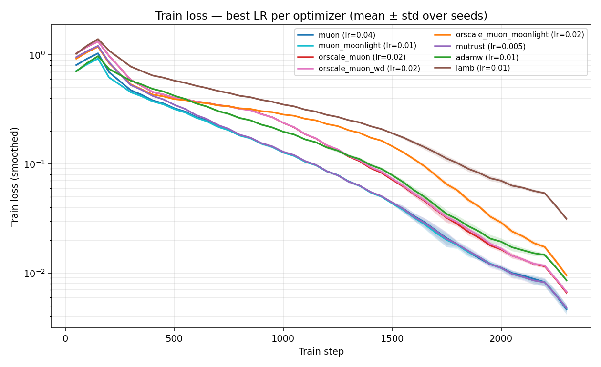
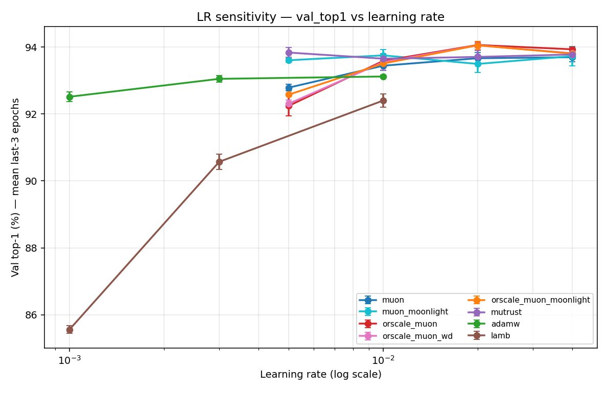
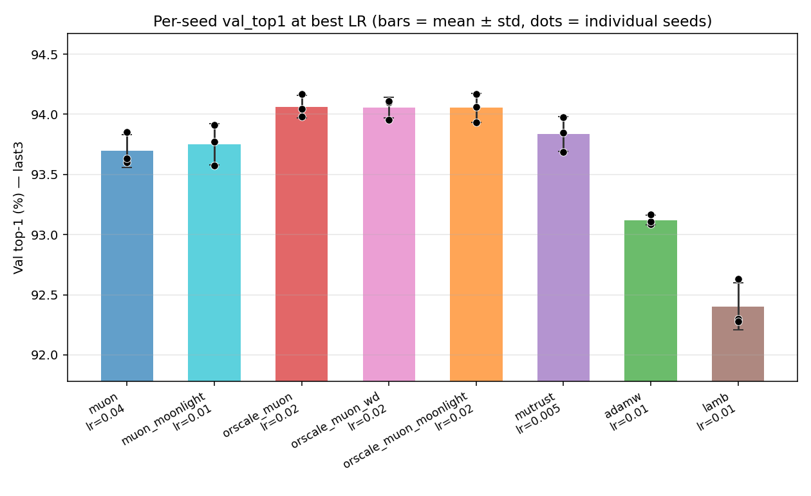
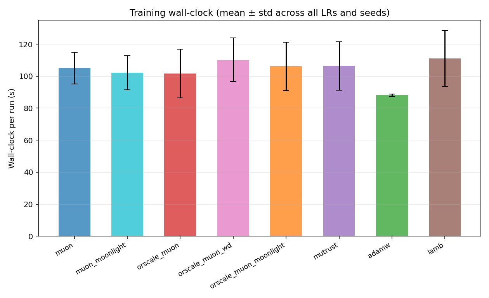

# CIFAR-10 / DavidNet optimizer sweep — analysis report

- Runs parsed: **90** (completed: 90)
- Optimizers: adamw, lamb, muon, muon_moonlight, mutrust, orscale_muon, orscale_muon_moonlight, orscale_muon_wd
- Learning rates swept: 0.001, 0.003, 0.005, 0.01, 0.02, 0.04
- Seeds: 42, 43, 44
- Headline metric: **val_top1, mean last-3 epochs** (mean over seeds, ± std dev)

## Ranking at best LR

1. **orscale_muon** @ lr=0.02 — 94.06% ± 0.09 (final: 94.10%, best-ever: 94.13%)
2. **orscale_muon_wd** @ lr=0.02 — 94.05% ± 0.08 (final: 94.08%, best-ever: 94.08%)
3. **orscale_muon_moonlight** @ lr=0.02 — 94.05% ± 0.12 (final: 94.04%, best-ever: 94.12%)
4. **mutrust** @ lr=0.005 — 93.84% ± 0.15 (final: 93.84%, best-ever: 93.87%)
5. **muon_moonlight** @ lr=0.01 — 93.75% ± 0.17 (final: 93.75%, best-ever: 93.78%)
6. **muon** @ lr=0.04 — 93.70% ± 0.14 (final: 93.75%, best-ever: 93.75%)
7. **adamw** @ lr=0.01 — 93.12% ± 0.04 (final: 93.13%, best-ever: 93.15%)
8. **lamb** @ lr=0.01 — 92.40% ± 0.20 (final: 92.46%, best-ever: 92.47%)

**Winner:** `orscale_muon` at lr=0.02 with 94.06% val_top1 (mean last-3 epochs), averaged over 3 seeds.

## Plots

### Head-to-head at best LR (mean ± std over seeds)

### LR sensitivity

### Per-seed variance at best LR

### Training wall-clock

## Tables

- Per (optimizer, lr) breakdown: `summary_by_opt_lr.md` / `.csv`
- Best LR per optimizer: `summary_best_lr.md` / `.csv`
- Raw tidy data: `runs.csv`, `epochs.csv`, `steps.csv`

